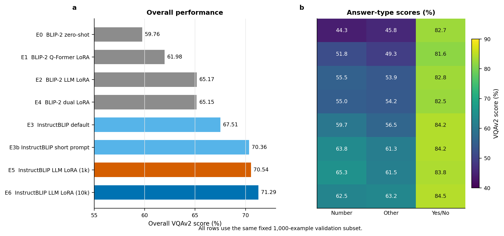
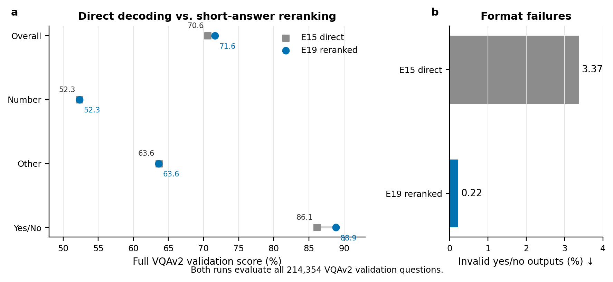
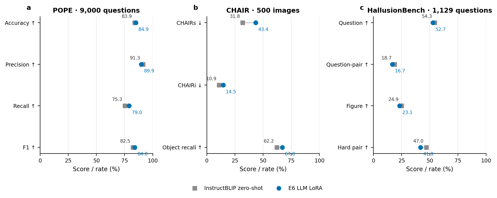
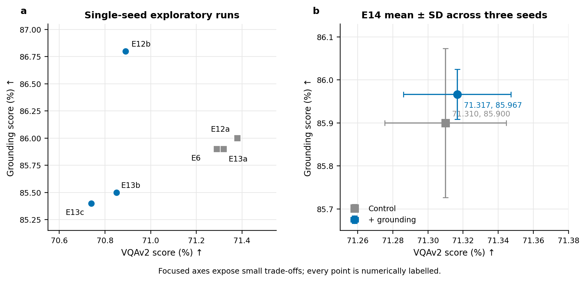
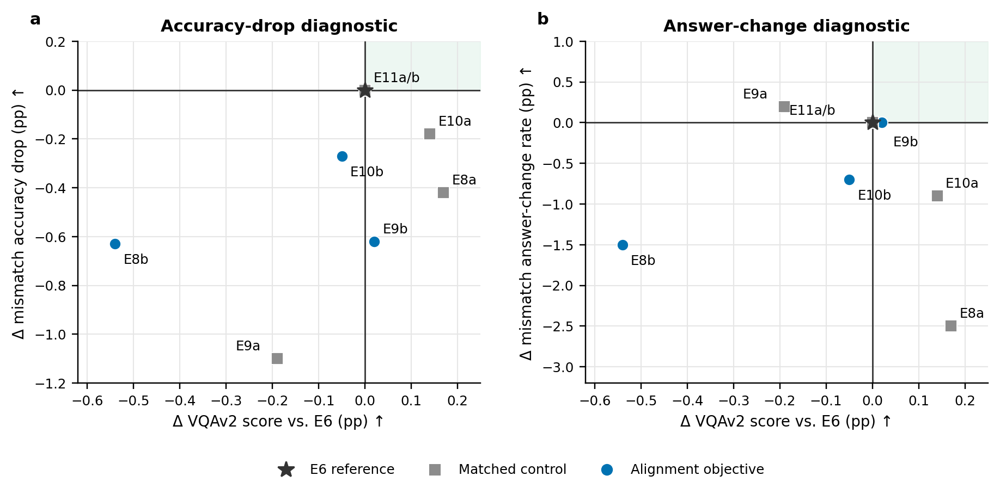

# Grounded VQA

Hallucination-aware parameter-efficient adaptation of BLIP-2 and InstructBLIP
on VQAv2. The project keeps code, datasets, model caches, environments, and
experiment outputs on the AutoDL data disk.

## Results at a glance

The figures below are generated directly from the tracked CSV summaries in
`reports/`. They distinguish fixed-subset development results from the full
VQAv2 validation run and retain negative findings instead of selecting only
favorable benchmarks.

| Evaluation | Reference | E6 / best decoding | Outcome |
| --- | ---: | ---: | ---: |
| VQAv2 fixed 1k, overall | 59.76 (E0) | 71.29 (E6) | +11.53 pp |
| VQAv2 full validation, overall | 70.61 (E15 direct) | 71.62 (E19 reranked) | +1.01 pp |
| POPE accuracy | 83.94 (zero-shot) | 84.93 (E6) | +0.99 pp |
| CHAIRs, lower is better | 31.80 (zero-shot) | 43.40 (E6) | 11.60 pp worse |
| HallusionBench question accuracy | 54.30 (zero-shot) | 52.70 (E6) | -1.60 pp |

### VQAv2 development progression



*Figure 1: The staged progression reaches 71.29 on the fixed 1,000-example
VQAv2 subset, 11.53 points above the BLIP-2 zero-shot starting point. The
comparison includes architecture, prompt, module, and training-scale changes;
the heatmap exposes their different effects across answer types.*

### Full-validation decoding



*Figure 2: Short-answer reranking raises full-validation accuracy from 70.61
to 71.62, driven by a yes/no gain from 86.14 to 88.86. It also reduces invalid
yes/no outputs from 3.37% to 0.22% across all 214,354 validation questions.*

### Hallucination benchmarks



*Figure 3: E6 improves POPE accuracy, recall, and F1, but worsens both CHAIR
hallucination rates and most HallusionBench aggregates. The mixed transfer
result is why E6 is treated as a VQA checkpoint, not a universal
hallucination-reduction model.*

### Grounding trade-offs



*Figure 4: Grounding additions produce small, method-dependent trade-offs
rather than a decisive improvement. Across the three-seed E14 comparison, the
grounding variant changes the mean by only +0.007 VQAv2 points and +0.067
grounding points, with overlapping standard-deviation bars.*

### Alignment-objective ablations



*Figure 5: No tested alignment objective improves both VQAv2 accuracy and the
image-dependence diagnostic relative to E6. Matched controls are shown as
squares, objective runs as circles, and the shaded upper-right quadrant marks
the desired joint improvement region.*

The complete tables, experimental protocol, and limitations are in
[`reports/FINAL_EXPERIMENT_SUMMARY.md`](reports/FINAL_EXPERIMENT_SUMMARY.md).
To regenerate every figure as README-ready PNG plus vector SVG and PDF:

```bash
python -m pip install -e '.[plots]'
python scripts/plot_readme_figures.py
```

## Test status

Last verified on 2026-09-02: 74 tests passed, Ruff reported no violations, and
all five figure groups regenerated successfully from the committed CSV files.

## Server layout

```text
/root/autodl-tmp/vision-language/
├── code/grounded-vqa       # this repository
├── data/vqav2              # questions, annotations, COCO images
├── models                  # optional exported checkpoints
├── outputs                 # adapters, predictions, metrics
├── logs                    # screen and training logs
├── cache                   # Hugging Face, PyTorch, pip, temporary files
└── venv                    # isolated Python environment
```

Run `source scripts/server_env.sh` before every command. The script refuses
to run when the expected data disk is absent and redirects all large caches.

## Initial validation

```bash
source scripts/server_env.sh
python -m pip install -e '.[dev]'
pytest

grounded-vqa-smoke \
  --model-id Salesforce/blip2-flan-t5-xl \
  --model-kind blip2 \
  --quantization 4bit

grounded-vqa-smoke \
  --model-id Salesforce/instructblip-flan-t5-xl \
  --model-kind instructblip \
  --quantization 4bit
```

## Data preparation

Metadata is small; COCO images are the large part. Start with validation-only
data, then add training images when the model smoke tests and evaluator pass.

```bash
grounded-vqa-download --split val --include-images
grounded-vqa-download --split train --include-images
```

Downloads use `.part` files, verify ZIP integrity before extraction, and check
free disk space before each artifact.

## Experiment sequence

1. BLIP-2 and InstructBLIP zero-shot baselines.
2. Q-Former-only, LLM-only, and dual-module LoRA on BLIP-2.
3. Dual-module LoRA on InstructBLIP with the same Flan-T5-XL backbone.
4. Complementary-pair and COCO-grounded hallucination probes.
5. Hallucination-aware hard-negative training.
6. Visual Contrastive Decoding and matched-decoding evaluation.

The active VQAv2 implementation sequence is in `EXECUTION_PLAN_VQAV2.md`.
`RESEARCH_AND_EXECUTION_PLAN.md` contains the broader literature survey and
the earlier GQA-centered alternative.

## External hallucination evaluation

The project evaluates both closed-form object existence and open-form object
hallucination. The same E6 adapter is always compared with the unadapted
InstructBLIP backbone.

```bash
bash scripts/run_h1_pope_zeroshot.sh
bash scripts/run_h1_pope.sh
bash scripts/run_h2_chair.sh
bash scripts/run_h3_hallusionbench.sh
```

- H1 uses all three official COCO POPE strategies (9,000 questions).
- H2 uses a persisted seed-42 selection of 500 COCO val2014 images and the
  standard prompt `Describe this image in detail.`.
- H3 uses all 1,129 HallusionBench questions, strict yes/no parsing, and records
  the white-image convention used for text-only control rows.

Results and limitations are consolidated in
`reports/FINAL_EXPERIMENT_SUMMARY.md` and `MODEL_CARD.md`.

## Alignment diagnostics and mismatch training

`grounded-vqa-diagnose-alignment` evaluates the same questions under normal,
different-image, gray-image, and noise-image conditions. It reports condition
accuracy, answer-change rate, unchanged-answer rate, and the rate at which the
normal image has a higher VQA score.

`grounded-vqa-train-mismatch` continues an existing LoRA adapter with:

```text
positive_nll + mismatch_weight * relu(margin + positive_nll - negative_nll)
```

Always compare it with a matched continuation control using
`--mismatch-weight 0`. The first conservative E8b pilot is a recorded negative
result; E6 remains the primary checkpoint. See `EXPERIMENT_LOG.md` for exact
metrics and artifact names.

`grounded-vqa-train-complementary` uses the official VQAv2 complementary
pairs as hard negatives. For each pair, it trains on both correct
(image, question, answer) examples and ranks each target answer above the same
answer under the paired image. The ranking term is a smooth, per-sequence
teacher-forced token-log-probability objective rather than the inactive hinge
used in E8b. Use `--contrastive-weight 0` for the exact matched control.

`grounded-vqa-mine-complementary` scores a deterministic candidate pool with a
frozen adapter and writes the pairs with the smallest correct-versus-swapped
image token-NLL margins. Its `selected_pairs.json` can be passed directly to
`grounded-vqa-train-complementary --pairs-file` for hard-pair continuation.

`grounded-vqa-train-mixed-qformer` keeps an existing LLM LoRA adapter frozen,
adds a trainable Q-Former LoRA adapter, mixes ordinary VQAv2 examples with hard
complementary pairs, and selects `best-adapter` using a held-out complementary
validation margin. Mixed-adapter manifests are understood by all prediction and
alignment diagnostic commands.
