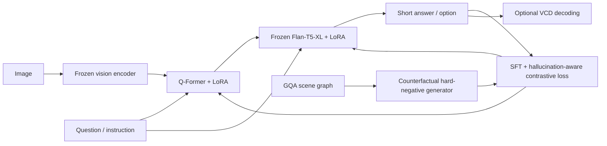

# Grounded-PEFT：面向组合式视觉问答的 BLIP-2 / InstructBLIP 双模块 LoRA 与幻觉抑制

## 摘要

本项目拟构建一个以 BLIP-2 与 InstructBLIP 为核心的视觉问答系统，并研究 Parameter-Efficient Fine-Tuning（PEFT）能否在有限算力下同时提升复杂跨模态推理能力和视觉忠实度。项目建议选择 GQA Balanced 作为唯一主训练数据集，因为其 scene graph、问题语义表示和组合推理结构既适合分析复杂推理，也可以自动构造有视觉依据的 object、attribute、relation、count 反事实负例。模型侧采用具有相同 Flan-T5-XL 语言骨干的 BLIP-2 与 InstructBLIP，以避免比较被不同 LLM 混淆；训练侧比较 Q-Former-only、LLM-only 和 Q-Former+LLM 双模块 LoRA；幻觉抑制侧以 scene-graph-grounded hard negatives 和 phrase/answer-level contrastive alignment 为主方法，以 Visual Contrastive Decoding（VCD）为低成本推理时插件，并把 on-policy DPO 作为高级扩展。最终交付不仅报告 GQA accuracy，还报告 consistency、validity、plausibility、各推理类型、幻觉分项和计算效率，从而避免以“少说、总答 no”伪装成幻觉下降。

## 1. 研究问题与范围

### 1.1 研究问题

**RQ1：** 在 BLIP-2 与 InstructBLIP 上，LoRA 应当适配 Q-Former、LLM，还是同时适配两者，才能以最少可训练参数获得最好的组合式视觉推理性能？

**RQ2：** 基于 scene graph 构造的视觉反事实 hard negatives，结合 LoRA 训练，能否降低 object、attribute、relation 和 count hallucination，同时保持或提高标准 GQA 能力？

**RQ3：** 训练时对齐与推理时视觉干预是否互补，还是仅通过更保守、更短的回答降低表面幻觉率？

### 1.2 操作性定义

本项目把 hallucination 定义为：**模型输出与输入图像可验证视觉事实不一致，但语言上仍然流畅或合理。** 研究范围包括：

- Object hallucination：声称不存在的物体存在。
- Attribute hallucination：颜色、大小、材质、状态等错误。
- Relation hallucination：空间、动作或实体关系错误。
- Count hallucination：数量错误。
- Reasoning inconsistency：对可相互推出的问题给出矛盾答案。

以下内容不作为主研究范围：

- 依赖外部百科知识的 factual hallucination。
- OCR、文档问答和视频问答。
- 医疗、自动驾驶等特定领域安全结论。

### 1.3 核心判断

现有证据支持一个条件性判断：**对于 BLIP-2 系架构，仅训练 Q-Former 是高效率基线，但复杂推理往往还需要适配语言端；减少幻觉则不能只依赖 LoRA 本身，而需要加入视觉约束的负例或偏好信号，并同时监测回答覆盖率和一般能力。**

## 2. 调研方法

本调研检索范围为 2022 年至 2026 年 8 月，优先纳入 ICML、NeurIPS、ICLR、CVPR、ICCV、ACL、EMNLP 及其正式 Findings 论文。检索分为四条独立线索：

1. BLIP-2 / InstructBLIP 架构与视觉指令调优。
2. LoRA、QLoRA 与 Q-Former 的 PEFT。
3. 多模态幻觉的评测与反证。
4. 训练时、解码时和权重/表示干预的幻觉缓解方法。

只使用能够核验标题、作者、会议和核心结论的论文。没有正式顶会版本但对路线有启发的工作，不作为核心结论的唯一依据。受当前执行约束影响，四条检索视角由同一研究流程串行完成，而不是由独立检索者并行完成；为降低选择偏差，反证与评测论文被单独检索并纳入综合。

## 3. 技术谱系与证据综合

### 3.1 BLIP-2 与 InstructBLIP：共同骨架，不同任务归纳偏置

BLIP-2 通过冻结 image encoder 和 LLM，并使用轻量 Q-Former 桥接视觉与语言，证明了大规模视觉语言适配并不必然需要端到端更新全部参数 [1]。InstructBLIP 在此基础上把 instruction 同时输入 Q-Former 和 LLM，使视觉特征抽取与当前问题相关，并通过多任务视觉指令调优增强零样本泛化 [2]。因此，两者适合形成匹配对照：BLIP-2 衡量通用视觉语言预训练的适配能力，InstructBLIP 衡量 instruction-aware Q-Former 带来的增益。

原始 BLIP-2 的 VQA downstream adaptation 会更新 Q-Former 和 image encoder、冻结 LLM；但后续针对 InstructBLIP 的系统研究表明，仅对 Q-Former 做 PEFT 可以用不到完整微调 2% 的可训练参数获得相近表现，而同时适配 Q-Former 和 LLM 在 ScienceQA、IconQA 等视觉推理任务上更有潜力 [5]。这说明本项目不应直接假设 “Q-Former-only 就足够”，而应把适配位置作为核心消融变量。

### 3.2 LoRA 是资源手段，不是幻觉方法

LoRA 用低秩矩阵表达权重更新，从而减少可训练参数和优化器状态 [3]；QLoRA 进一步把冻结基础模型量化为 4-bit，并在其上训练 LoRA adapter [4]。二者解决的是训练成本，而不是视觉真实性。若监督数据含有语言偏置或错误关联，LoRA 同样会学习这些偏置。因此项目必须分开验证：

- PEFT efficiency：显存、训练时间、参数量。
- Task adaptation：GQA accuracy 和推理分项。
- Faithfulness：幻觉、矛盾和视觉依赖。

### 3.3 幻觉评测不能只看一种问答格式

POPE 使用平衡的 object existence 问题测量 object hallucination [6]，适合快速、稳定地检查 yes/no 偏置；HallusionBench 则使用原图、编辑图及控制问题分析 language hallucination 与 visual illusion [7]。THRONE 进一步指出，针对固定选项或 yes/no 的 Type II hallucination 与自由生成中的 Type I hallucination 可能不一致甚至反相关 [8]。因此，仅在 POPE 上提高 precision 不足以证明模型更忠实，它可能只是更倾向回答 “no”。

本项目必须同时保留：

- 短答案 VQA：GQA 官方 accuracy 和分类型指标。
- 平衡存在性测试：accuracy、precision、recall、F1、yes-ratio。
- 自由回答测试：object/attribute/relation hallucination rate 与回答覆盖率。
- 成对一致性测试：同义、蕴含、反事实问题的一致性。

### 3.4 幻觉缓解方法的三类路线

| 路线 | 代表工作 | 机制 | 优势 | 主要风险 | 与本项目兼容性 |
|---|---|---|---|---|---|
| 推理时解码 | VCD [9]、OPERA [10]、INTER [18] | 对比原图/扰动图分布，或调整注意力与采样 | 无需重训，适合插件和消融 | 增加推理开销；可能损失语言先验和答案覆盖 | 高，优先实现 VCD |
| 对比/短语级训练 | HACL [11]、HALVA [14] | 把 hallucinated response 当 hard negative，强化视觉-文本对齐 | 与 LoRA/SFT 易组合；直接优化表示 | 负例质量决定上限；可能过拟合模板 | 最高，作为核心方法 |
| 偏好对齐 | RLHF-V [12]、Factually Augmented RLHF [13]、OPA-DPO [15] | 通过 chosen/rejected 或细粒度纠错学习行为边界 | 可利用少量高质量偏好数据 | DPO 对 off-policy 数据敏感；可能变得保守和遗漏细节 | 中高，作为高级扩展 |
| 表示/权重干预 | ICT [16]、Nullu [17] | 在 attention/weight subspace 中抑制 hallucination direction | 可低成本部署，有些方法无额外推理开销 | 多在 LLaVA 系验证，迁移到 BLIP-2 未被直接证实 | 中，作为未来扩展 |

VCD 与 OPERA 都在不额外训练的情况下改变解码，但 VCD 通过原始与视觉扰动输入的输出分布对比抑制语言先验，OPERA 则惩罚对少数 summary token 的过度依赖并在需要时回滚 [9,10]。HACL 与 HALVA 都使用 hallucinated text 作为负例，但前者强调跨模态表示对比，后者进一步使用 phrase-level alignment 以尽量保存通用能力 [11,14]。RLHF-V 说明细粒度纠错反馈具有较高数据效率，而 OPA-DPO 指出普通 DPO 若 chosen response 偏离基础策略分布，可能因隐含 KL 约束而学不到专家修订；因此高级阶段应优先生成当前模型自己的错误，再纠正为 on-policy preference pair [12,15]。

2025 年的 ICT 与 Nullu 分别从 attention intervention 和 hallucination subspace projection 入手，说明幻觉缓解正在从“再训练一个模型”扩展到局部表示干预 [16,17]；INTER 则在 ICCV 2025 中以 interaction-guided sampling 延续训练自由路线 [18]。同年的机制研究还提示，长回答更易产生幻觉不只是 token 数量累积，而与生成过程中越来越依赖既有文本上下文有关 [19]。但这些方法主要在其他 LVLM 家族验证，把它们直接移植到 BLIP-2/InstructBLIP 应视为研究假设，而不是已证实结论。

## 4. 最终项目定义

### 4.1 项目题目

**Grounded-PEFT: Hallucination-Aware Dual-Module LoRA Adaptation of BLIP-2 and InstructBLIP for Compositional Visual Question Answering**

中文：**面向组合式视觉问答的 BLIP-2 / InstructBLIP 双模块 LoRA 与视觉幻觉抑制研究**

### 4.2 主数据集选择

选择 **GQA Balanced** 作为唯一主训练与标准评测数据集，原因如下：

- 比 VQAv2 更直接地测试 spatial、relational、compositional 和 multi-step reasoning。
- scene graph 可作为视觉事实来源，生成可验证的 hard negatives。
- functional programs 和 question groups 支持按推理步骤诊断。
- 官方提供 accuracy、consistency、validity、plausibility、distribution 等指标。

POPE、HallusionBench 或 THRONE 只作为外部测试集，不参与训练；如果课程规则将“只能选择一个数据集”解释得非常严格，则外部 benchmark 可以替换为从 GQA test-dev 构造的固定 hallucination probe set。

### 4.3 模型选择

主比较必须共享同一语言骨干：

- `Salesforce/blip2-flan-t5-xl`
- `Salesforce/instructblip-flan-t5-xl`

不建议主实验混用 BLIP-2 OPT、InstructBLIP Vicuna，因为性能变化会同时包含 architecture、tokenizer、LLM pretraining 和 license 的影响，无法归因于 instruction-aware Q-Former。

### 4.4 推荐系统架构



### 4.5 LoRA 适配位置

必须完成四组对照：

1. **Q-Former full fine-tuning / LLM frozen**：接近传统 downstream adaptation，作为高参数基线。
2. **Q-Former LoRA only**：测试视觉语言对齐端的极致参数效率。
3. **LLM LoRA only**：测试语言推理适配但视觉桥接冻结时的表现。
4. **Dual LoRA**：同时适配 Q-Former 和 LLM，作为最终主模型。

建议初始搜索空间：

| 参数 | 起始值 | 搜索范围 |
|---|---:|---:|
| LoRA rank | 16 | 8 / 16 / 32 |
| LoRA alpha | 32 | 16 / 32 / 64 |
| LoRA dropout | 0.05 | 0.0 / 0.05 / 0.1 |
| Learning rate | 1e-4 | 5e-5 / 1e-4 / 2e-4 |
| Warmup ratio | 0.03 | 0.0 / 0.03 / 0.1 |
| Max answer tokens | 10 | 5 / 10 / 20 |

Q-Former 至少尝试 self-attention 的 query/value、cross-attention 的 query/key/value/output；LLM 先尝试 attention 的 query/value，再决定是否扩展到 key/output 和 FFN。目标模块名必须从实际 `named_modules()` 中发现并测试，不能依赖未经验证的字符串硬编码。

## 5. 幻觉负例与训练目标

### 5.1 Scene-graph-grounded hard negatives

每个负例都必须通过 GQA scene graph 验证为错误，避免用另一个语言模型随意制造“可能错误”的答案。

| 类型 | 正答案 | 负例构造 | 校验规则 |
|---|---|---|---|
| Object | dog | 替换为语义上常见但图中不存在的 cat | object 不在 scene graph |
| Attribute | red | 替换为 blue/green | 目标 object 不具有该 attribute |
| Relation | left of | 交换为 right of/behind | relation edge 不成立 |
| Count | 3 | 替换为 2 或 4 | 与目标 object 数量不一致 |
| Existence | yes | 变为 no，或换成不存在对象 | scene graph 可确定真假 |

负例分为三级：

- Easy：随机错误答案，用于检查训练管线。
- Plausible：同类、同属性域或常见共现对象，作为主要 hard negative。
- Model-induced：由当前模型生成且与 scene graph 冲突，作为 on-policy 高级负例。

### 5.2 两阶段训练

**Stage A：VQA SFT**

使用正确短答案做 token-level cross entropy，使模型先获得稳定任务能力。

\[
\mathcal{L}_{SFT}=-\sum_t \log p_\theta(y_t^+\mid I,q,y_{<t}^+)
\]

**Stage B：Hallucination-aware alignment**

核心可交付版本使用 margin/contrastive loss，把正确答案相对 hallucinated answer 拉高：

\[
\mathcal{L}_{HA}=\max(0,m-s_\theta(I,q,y^+)+s_\theta(I,q,y^-))
\]

总目标：

\[
\mathcal{L}=\mathcal{L}_{SFT}+\lambda\mathcal{L}_{HA}
\]

高级扩展使用 on-policy DPO：先由 SFT 后模型生成答案，自动定位 scene-graph 冲突，再把纠正答案和原错误答案组成 chosen/rejected pair。不得只依赖另一个大模型生成 off-policy 文本。

### 5.3 多项选择适配

利用同一 hard-negative generator 为每题生成 1 个正确答案和 3 个 plausible distractors，随机打乱候选顺序。多项选择只作为额外评测，不与 GQA 官方 open-answer accuracy 混算。必须检查：

- 正确答案唯一。
- 各选项长度和语法风格接近。
- 选项位置均衡。
- 不通过措辞泄露答案。

这样可在不引入第二个主数据集的情况下覆盖原项目说明中的 multiple-choice 要求。

## 6. 实验矩阵

### 6.1 必做实验

| ID | Backbone | 训练方式 | 幻觉训练 | 解码 | 目的 |
|---|---|---|---|---|---|
| E0 | BLIP-2 | Zero-shot | 无 | Greedy | 基础能力 |
| E1 | InstructBLIP | Zero-shot | 无 | Greedy | 指令调优增益 |
| E2 | BLIP-2 | Q-Former LoRA | 无 | Greedy | 对齐端 PEFT |
| E3 | BLIP-2 | LLM LoRA | 无 | Greedy | 语言端 PEFT |
| E4 | BLIP-2 | Dual LoRA | 无 | Greedy | 双模块主基线 |
| E5 | InstructBLIP | Dual LoRA | 无 | Greedy | 匹配骨干比较 |
| E6 | BLIP-2 | Dual LoRA | HA contrastive | Greedy | 主方法 |
| E7 | InstructBLIP | Dual LoRA | HA contrastive | Greedy | 主方法跨骨干验证 |
| E8 | E6 最优模型 | 同 E6 | 同 E6 | VCD | 训练与解码互补性 |
| E9 | E7 最优模型 | 同 E7 | 同 E7 | VCD | 训练与解码互补性 |

### 6.2 高级扩展

| ID | 扩展 | 进入条件 |
|---|---|---|
| X1 | Q-Former full fine-tuning | 显存足够且需比较 LoRA 效率 |
| X2 | AdaLoRA | Dual LoRA 已稳定，想分析层重要性 |
| X3 | On-policy DPO with LoRA | HA contrastive 已完成且能稳定生成负例 |
| X4 | OPERA / INTER | VCD 已验证且有额外实现时间 |
| X5 | ICT / Nullu 式表示干预 | 作为后续论文方向，不阻塞项目交付 |

### 6.3 消融实验

- LoRA location：Q-Former vs LLM vs both。
- LoRA rank：8、16、32。
- Negative type：object only vs all four types。
- Negative difficulty：random vs plausible vs model-induced。
- Loss：SFT vs SFT+HA。
- Decoder：greedy vs VCD。
- Question image ablation：正常图、空白图、错配图。
- Response length：固定短答案与较长解释，检查长度-幻觉关系。

主消融可以先单随机种子筛选，最终 E4-E9 至少运行 3 个随机种子并报告均值、标准差和 bootstrap 95% confidence interval。

## 7. 评测协议

### 7.1 GQA 官方与任务指标

- Overall accuracy。
- Binary / Open accuracy。
- Accuracy by question family。
- Accuracy by reasoning step count。
- Consistency。
- Validity。
- Plausibility。
- Distribution。
- Grounding（仅在 attention 定义与官方脚本兼容时报告）。

### 7.2 幻觉指标

- Object existence：balanced accuracy、precision、recall、F1、yes-ratio。
- Attribute、relation、count hallucination accuracy。
- Hallucination rate：错误且与 scene graph 冲突的答案比例。
- Pair consistency：互为蕴含/反事实的问题是否同时正确。
- Free-form coverage：正确提及的视觉事实数量。
- Omission rate：通过少说而回避的事实比例。
- Average response length。

### 7.3 效率指标

- Trainable parameters 和占总参数比例。
- Peak GPU memory。
- Samples/second。
- 每 epoch wall-clock time。
- Adapter checkpoint size。
- 推理延迟；VCD 需单独报告相对开销。

### 7.4 防止虚假改进

满足以下全部条件才称为“减少幻觉”：

1. 至少一个 hallucination metric 显著改善。
2. Overall GQA accuracy 不出现不可接受下降。
3. yes-ratio、recall 和 coverage 不发生明显塌缩。
4. 回答长度在相同解码约束下比较。
5. 正常图相对空白图/错配图的性能差距扩大，证明视觉依赖增强。

## 8. 工程实现规划

### 8.1 建议技术栈

- Python 3.10 或 3.11，版本在首个可运行环境后锁定。
- PyTorch、Transformers、PEFT、Accelerate。
- bitsandbytes：仅在目标 GPU/Windows 或 Linux 环境验证兼容后启用。
- Hugging Face Datasets 或自定义 streaming dataset。
- 官方 GQA evaluation scripts。
- TensorBoard 或 Weights & Biases，二选一并统一使用。
- Gradio：最终演示界面。

主实现建议使用 Hugging Face Transformers，以统一 BLIP-2、InstructBLIP 与 PEFT；LAVIS 用于核对官方预处理和原始模型行为，不同时维护两套训练框架。

### 8.2 推荐仓库结构

```text
vision-language/
├── README.md
├── pyproject.toml
├── configs/
│   ├── data/gqa_balanced.yaml
│   ├── model/blip2_flant5xl.yaml
│   ├── model/instructblip_flant5xl.yaml
│   └── experiment/*.yaml
├── scripts/
│   ├── prepare_gqa.py
│   ├── build_hallucination_pairs.py
│   ├── train_sft.py
│   ├── train_ha.py
│   ├── evaluate_gqa.py
│   └── evaluate_hallucination.py
├── src/grounded_peft/
│   ├── data/
│   ├── models/
│   ├── losses/
│   ├── decoding/
│   ├── evaluation/
│   └── utils/
├── tests/
├── reports/
├── demo/
└── artifacts/README.md
```

### 8.3 资源分级

**24 GB 单卡目标方案：**

- Flan-T5-XL 统一骨干。
- 冻结 vision encoder。
- LLM 使用 4-bit 或 8-bit 加载并训练 LoRA。
- Q-Former 使用 bf16/fp16 LoRA。
- Batch size 1–2，加 gradient accumulation。
- 开启 gradient checkpointing 和 mixed precision。

**48 GB 或多卡增强方案：**

- 增大 effective batch size。
- 加入 Q-Former full fine-tuning 对照。
- 运行更多 rank、seed 和 DPO 实验。

资源数值是启动配置，不是显存保证；必须以 32 个样本的 profiling run 测出真实峰值后再锁定 batch size。

## 9. 十二周执行路线

### Week 1：范围冻结与环境基线

- 写 README、环境文件、配置规范和实验命名规则。
- 完成两个 checkpoint 的单图推理。
- 记录模型版本、revision、prompt template 和解码参数。
- 输出：`env-lock`、inference smoke test、10 个定性案例。
- Gate：同一图片和问题可由两模型稳定生成答案。

### Week 2：GQA 数据与官方评测

- 下载 GQA Balanced 与图片。
- 建立 train/val/test-dev manifest 和哈希。
- 实现 answer normalization、collator、缓存和小样本模式。
- 接入官方 evaluation。
- Gate：人工抽查 100 个样本，image/question/answer 对齐率 100%；固定预测文件可重复得到相同指标。

### Week 3：Zero-shot 与偏置诊断

- 完成 E0、E1。
- 增加 no-image、blank-image、mismatched-image 诊断。
- 分析 binary/open、question family 和 answer frequency。
- Gate：获得第一版结果表，并明确两模型的主要失败类型。

### Week 4：LoRA 基础设施

- 自动发现 Q-Former/LLM 可适配模块。
- 完成 adapter 注入、保存、加载、合并和恢复训练测试。
- 在 1k–5k 样本上过拟合，验证 loss 能下降。
- Gate：只有预期 adapter 参数具有梯度；checkpoint 重载预测一致。

### Week 5：BLIP-2 PEFT 消融

- 完成 E2、E3、E4。
- 记录 trainable params、VRAM、速度和 accuracy。
- 选择 rank 与 learning rate。
- Gate：至少一个 LoRA 方案显著优于 BLIP-2 zero-shot；否则排查 prompt、label、tokenization 和学习率。

### Week 6：InstructBLIP 匹配实验

- 完成 E5，并用与 BLIP-2 相同的数据、语言骨干和预算。
- 比较 instruction-aware Q-Former 的收益。
- Gate：形成可归因的 backbone comparison，不允许改变多个变量后直接比较。

### Week 7：Grounded hard-negative pipeline

- 实现 object/attribute/relation/count 四类负例。
- 建立 easy、plausible、model-induced 难度标签。
- 构造 multiple-choice 辅助集。
- Gate：每类随机审计至少 200 例，错误答案确实与 scene graph 冲突，正确选项唯一。

### Week 8：Hallucination-aware LoRA

- 完成 SFT+HA loss。
- 先在 BLIP-2 上完成 E6，再迁移到 InstructBLIP 完成 E7。
- 调整 `lambda` 和 margin，观察一般能力-幻觉权衡。
- Gate：幻觉指标改善且 GQA accuracy、coverage 未塌缩。

### Week 9：推理时方法

- 实现 VCD，完成 E8、E9。
- 固定输出长度、temperature、beam/sampling 设置。
- 报告性能与延迟的 Pareto curve。
- Gate：确认 VCD 增益不是由更短回答或 yes/no 偏置造成。

### Week 10：高级对齐与外部验证

- 若主线稳定，构造 on-policy chosen/rejected pairs 并尝试 DPO-LoRA。
- 在 POPE、HallusionBench 或内部固定 probe set 上做零样本外部评测。
- Gate：高级实验失败不阻塞主项目；所有失败原因和负结果保留。

### Week 11：统计、错误分析与演示

- 最优模型运行 3 个 seeds。
- Bootstrap CI、paired significance test。
- 人工标注至少 200 个错误案例。
- 建立 Gradio demo：图片、问题、答案、confidence、baseline/HA/VCD 切换。
- Gate：结果表可由原始 prediction 文件重新生成。

### Week 12：复现与最终报告

- 从干净环境执行一次 data → train → evaluate → demo。
- 完成论文式报告、model card、data card 和 limitations。
- 固化最终 checkpoint、adapter、config、日志和 predictions。
- Gate：另一台机器或新环境可以按 README 复现实验子集。

## 10. 交付标准

### 10.1 最小可交付版本（MVP）

- BLIP-2 与 InstructBLIP zero-shot。
- BLIP-2 Q-Former/LLM/Dual LoRA。
- InstructBLIP Dual LoRA。
- GQA 官方评测与效率表。
- 一个稳定的 hallucination probe set。
- 至少一种训练时幻觉缓解方法。
- README 和可运行 demo。

### 10.2 完整项目

- E0–E9 全部完成。
- 四类 scene-graph-grounded hard negatives。
- 3-seed 结果和统计区间。
- 标准能力、幻觉、覆盖率和效率四维评测。
- 模块、rank、负例和 decoding 消融。
- 200 例以上人工错误分析。
- 模型权重或 LoRA adapter、配置、预测和复现脚本。

### 10.3 论文级扩展

- On-policy DPO-LoRA。
- 比较 contrastive alignment 与 DPO。
- 检查方法能否跨 BLIP-2 / InstructBLIP 和外部 benchmark 泛化。
- 视觉 grounding 或 attention intervention 分析。
- 对负例生成质量、一般能力保持和保守退化做系统消融。

## 11. 风险与止损规则

| 风险 | 早期信号 | 应对 | 止损点 |
|---|---|---|---|
| 显存不足 | 首批前向即 OOM | 量化 LLM、减 batch、checkpointing | 不升级到 XXL/Vicuna-13B |
| LoRA 未命中模块 | trainable params 为 0 或 loss 不降 | 枚举模块、梯度单测 | 不盲目扩大 rank |
| 幻觉率下降但能力下降 | recall/coverage/accuracy 同时跌 | 降低 HA 权重、混合普通 SFT | 保留 SFT 主模型，HA 作为分析结果 |
| 负例有噪声 | 人审发现 scene graph 与图片不一致 | 规则过滤、置信分级 | 只用高置信 object/count 子集 |
| DPO 不稳定 | chosen/rejected margin 不变 | on-policy 数据、降低 beta/lr | DPO 降级为高级负结果，不阻塞交付 |
| 两模型比较不公平 | prompt、LLM 或数据不同 | 共享 Flan-T5-XL、固定 pipeline | 不发布不可归因结论 |
| 指标被回答风格操纵 | 输出变短、总答 no | coverage、yes-ratio、长度控制 | 不把单一 POPE precision 当结论 |

## 12. 预期结论边界

项目完成后可以合理声称：

- 使用 LoRA 对 BLIP-2/InstructBLIP 进行了参数高效的复杂视觉推理适配。
- 比较了 Q-Former 与语言端适配的贡献和计算代价。
- 使用可验证视觉事实构造 hard negatives，并评估了其对多类幻觉的影响。
- 在相同解码和回答覆盖约束下分析了训练时与推理时方法的互补性。

在没有额外实验前不能声称：

- 方法消除了所有多模态幻觉。
- GQA 结果可泛化到医学、自动驾驶或知识型 VQA。
- BLIP-2/InstructBLIP 上的某方法优于所有最新 LVLM。
- 单一 benchmark 的提升代表通用视觉真实性提升。

## 13. 结论：逐项回答研究问题

**RQ1：** 文献和架构分析支持把 Dual LoRA 设为主模型、Q-Former-only 与 LLM-only 设为必要消融。Q-Former-only 预计最省参数，而 Dual LoRA 更可能覆盖视觉对齐与语言推理两侧；具体结论必须由 GQA 匹配实验确认。

**RQ2：** HACL、HALVA、RLHF-V 与 OPA-DPO 共同提示，高质量 hallucinated negatives 或细粒度偏好是降低幻觉的关键，而 GQA scene graph 为自动产生可验证负例提供了比自由生成更可靠的监督来源。最可行的首选是 SFT + hallucination-aware contrastive loss，DPO 作为 on-policy 扩展。

**RQ3：** VCD、OPERA、ICT、Nullu 和 INTER 表明训练自由或局部干预具有价值，但 THRONE 等评测工作说明不同形式的幻觉不会自动同步下降。本项目必须把训练方法、VCD、回答覆盖率和视觉依赖诊断放在同一实验矩阵中，才能判断它们是真正互补还是仅造成保守回答。

## References

[1] Junnan Li, Dongxu Li, Silvio Savarese, Steven Hoi, “BLIP-2: Bootstrapping Language-Image Pre-training with Frozen Image Encoders and Large Language Models,” ICML, 2023.

[2] Wenliang Dai, Junnan Li, Dongxu Li, et al., “InstructBLIP: Towards General-purpose Vision-Language Models with Instruction Tuning,” NeurIPS, 2023.

[3] Edward J. Hu, Yelong Shen, Phillip Wallis, et al., “LoRA: Low-Rank Adaptation of Large Language Models,” ICLR, 2022.

[4] Tim Dettmers, Artidoro Pagnoni, Ari Holtzman, Luke Zettlemoyer, “QLoRA: Efficient Finetuning of Quantized LLMs,” NeurIPS, 2023.

[5] Sungkyung Kim, Adam Lee, Junyoung Park, et al., “Towards Efficient Visual-Language Alignment of the Q-Former for Visual Reasoning Tasks,” Findings of EMNLP, 2024.

[6] Yifan Li, Yifan Du, Kun Zhou, Jinpeng Wang, Xin Zhao, Ji-Rong Wen, “Evaluating Object Hallucination in Large Vision-Language Models,” EMNLP, 2023.

[7] Tianrui Guan, Fuxiao Liu, Xiyang Wu, et al., “HallusionBench: An Advanced Diagnostic Suite for Entangled Language Hallucination and Visual Illusion in Large Vision-Language Models,” CVPR, 2024.

[8] Prannay Kaul, Zhizhong Li, Hao Yang, et al., “THRONE: An Object-based Hallucination Benchmark for the Free-form Generations of Large Vision-Language Models,” CVPR, 2024.

[9] Sicong Leng, Hang Zhang, Guanzheng Chen, et al., “Mitigating Object Hallucinations in Large Vision-Language Models through Visual Contrastive Decoding,” CVPR, 2024.

[10] Qidong Huang, Xiaoyi Dong, Pan Zhang, et al., “OPERA: Alleviating Hallucination in Multi-Modal Large Language Models via Over-Trust Penalty and Retrospection-Allocation,” CVPR, 2024.

[11] Chaoya Jiang, Haiyang Xu, Mengfan Dong, et al., “Hallucination Augmented Contrastive Learning for Multimodal Large Language Model,” CVPR, 2024.

[12] Tianyu Yu, Yuan Yao, Haoye Zhang, et al., “RLHF-V: Towards Trustworthy MLLMs via Behavior Alignment from Fine-grained Correctional Human Feedback,” CVPR, 2024.

[13] Zhiqing Sun, Sheng Shen, Shengcao Cao, et al., “Aligning Large Multimodal Models with Factually Augmented RLHF,” Findings of ACL, 2024.

[14] Pritam Sarkar, Sayna Ebrahimi, Ali Etemad, et al., “Mitigating Object Hallucination in MLLMs via Data-Augmented Phrase-Level Alignment,” ICLR, 2025.

[15] Zhihe Yang, Xufang Luo, Dongqi Han, Yunjian Xu, Dongsheng Li, “Mitigating Hallucinations in Large Vision-Language Models via DPO: On-Policy Data Hold the Key,” CVPR, 2025.

[16] Junzhe Chen, Tianshu Zhang, Shiyu Huang, et al., “ICT: Image-Object Cross-Level Trusted Intervention for Mitigating Object Hallucination in Large Vision-Language Models,” CVPR, 2025.

[17] Le Yang, Ziwei Zheng, Boxu Chen, et al., “Nullu: Mitigating Object Hallucinations in Large Vision-Language Models via HalluSpace Projection,” CVPR, 2025.

[18] Xin Dong, Shichao Dong, Jin Wang, et al., “INTER: Mitigating Hallucination in Large Vision-Language Models by Interaction Guidance Sampling,” ICCV, 2025.

[19] Ge Zheng, Jiaye Qian, Jiajin Tang, Sibei Yang, “Why LVLMs Are More Prone to Hallucinations in Longer Responses: The Role of Context,” ICCV, 2025.
